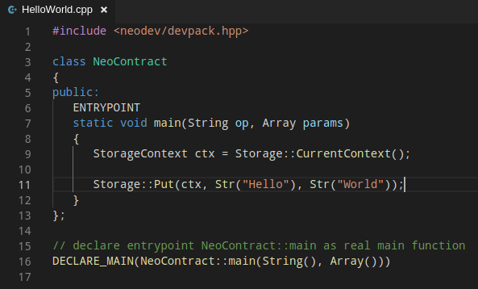
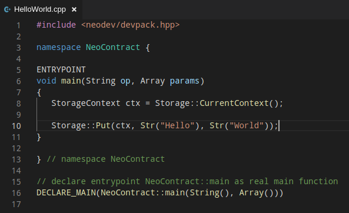

# neo-cpp-devpack
C++ devpack for Neo blockchain


## online editors

Code can be compiled using online WebAssembly editors.
Suggestion: `https://mbebenita.github.io/WasmExplorer/` (Select C++1z or C++17)

## Hello World example

### class based 



### global-function based 




## dependencies

To compile, you will need emscripten `emcc`, since the process uses using WebAssembly Neo Compiler (see `wasm2neo` project).

### clang + llvm + Binaryen + WABT (specific 2017 version)

A good combination is manually install clang + llvm (**WARNING: this will take 30 Gigabytes and several hours**)
```
mkdir make-llvm
mkdir clang (and clone)
mkdir llvm (and clone)
(cd clang && git checkout e4de58127fa1d8d22ee8043cef9b4d8a807b6cde)
(cd llvm && git checkout 08b86793476e08fc0937e70058e2a94808c988e7)
(mkdir build && cd build && cmake -DLLVM_ENABLE_PROJECTS=clang -G "Unix Makefiles" -DLLVM_TARGETS_TO_BUILD= -DLLVM_EXPERIMENTAL_TARGETS_TO_BUILD=WebAssembly ../llvm)
```

You will also need specific version of binaryen and wabt
```
mkdir binaryen (and clone)
(cd binaryen && git checkout b16768ec9b72d075ae2e36cc85aa216fdf4fd354)
mkdir wabt (and clone)
(cd wabt && git checkout 8e1f6031e9889ba770c7be4a9b084da5f14456a0)

each of these require specific builds as well.. all cmake style
```

## dependencies II (using EMSDK)

EMSDK looks promising as it is a all-in-one solution for cpp -> wasm. 
However, it's still slightly 

### Building EMSDK

```
git clone https://github.com/emscripten-core/emsdk.git
cd emsdk
./emsdk install latest
# Make the "latest" SDK "active" for the current user. (writes ~/.emscripten file)
./emsdk activate latest
# Activate PATH and other environment variables in the current terminal
source ./emsdk_env.sh
```

WABT may still be needed...

### Building WABT (WebAssembly Toolkit)

```
git clone git@github.com:WebAssembly/wabt.git
cd wabt
mkdir build
cd build
cmake ..
cmake --build .
```

## dependencies III (using wac)

Another interesting project is `wac`, for a direct translation and execution of web assembly using C language. No much testing have been done on it, but at least, its docker image is quite small! (less than 2GB)

### Building wac
No build info now.


## License

MIT 2019
